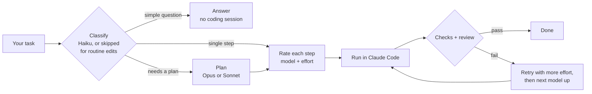

# Smart

[](https://github.com/Aaron40776/Smart/actions/workflows/ci.yml)
[](LICENSE)

**Claude Code, routed to the cheapest model that can do each step well.**

`smart` is a full-screen terminal UI (and a headless CLI) around [Claude Code](https://code.claude.com/docs/en/overview). You type a task
as you would in Claude Code; `smart` decides which Claude model and how much thinking effort each part of it needs, runs it through
Claude Code, checks the result, and moves to a stronger model only when a step fails. It shows what every call costs.

## Why

Running Claude Code on one fixed model means paying Opus prices for typo fixes, or getting Sonnet results on a concurrency bug.
`smart` makes that choice per task and per step. Typical outcomes with the default settings:

| You type | What `smart` does |
| --- | --- |
| `hey` | one short Haiku call, no coding session |
| `what does a mutex do?` | answered by the classifier call itself (Haiku), or one tool-free call on a stronger model if it is harder |
| `fix the typo in the README` | recognised locally, no classifier call; Sonnet at low effort; your checks; done |
| `add dark mode to the settings page` | classified; if it needs several steps, planned by Sonnet; each step rated, run, checked and reviewed |
| `build a REST API with auth and tests` | planned by Opus, steps routed individually (scaffolding on Sonnet, the hard parts on Opus) |

Follow-ups continue the same Claude Code session, so "now make it red" has the real history and the prompt cache.

It is for developers who already use Claude Code and want lower usage without hand-picking `--model` for every task.

## How routing works



1. **Classify.** A cheap model (Haiku) sorts the task by size and difficulty. Routine one-line edits skip this call.
2. **Plan**, only for multi-part work: Opus for big or hard builds, Sonnet for mid-size changes.
3. **Rate.** Each step gets a 0–1 difficulty score from local text signals, the classifier's opinion and the planner's rating of
   that step. The score picks a rung on a cost ladder: Haiku → Sonnet (low, medium, high effort) → Opus (medium, high, xhigh).
   The rating also learns from which rungs passed first time in your own history.
4. **Run** the step in Claude Code, then **check** it: your project's `typecheck`, `lint`, `build` and `test` scripts, and a
   short review by a cheap model against the step's acceptance criteria.
5. **Escalate** on failure: one retry with more effort, then the next model up. Failures that are not the model's fault (a check
   that cannot run, a usage limit, an overloaded API) stop or wait instead of escalating.

`smart --rate "your task"` shows the decision and the reasons without calling a model. The full algorithm, its numbers and
every setting that tunes it: **[ROUTING.md](ROUTING.md)**.

## Requirements

| | |
| --- | --- |
| OS | **Windows 10 or 11** (supported, tested in CI). Linux and macOS are not supported: the test suite also runs on Linux, but the installer, updater and docs are Windows-only and nothing else is tested there. |
| Node.js | 22 or newer (CI tests Node.js 22 and 24) |
| Git | needed by the installer and for `/undo` and `/diff` |
| Claude Code | the [`claude` CLI](https://code.claude.com/docs/en/overview), logged in (run `claude` once) |

## Install

`smart` is installed from this repository (it is not published to npm). In PowerShell:

```powershell
irm https://raw.githubusercontent.com/Aaron40776/Smart/main/install.ps1 | iex
```

The installer checks Git, Node.js and Claude Code, clones this repository into `%USERPROFILE%\Smart`, installs the exact dependency versions
from `package-lock.json` with `npm ci --ignore-scripts` (no package install scripts run), builds, and puts `smart` on your `PATH` with `npm link`.
Open a new terminal afterwards.

- **Read it first** (recommended): `irm https://raw.githubusercontent.com/Aaron40776/Smart/main/install.ps1 -OutFile install.ps1`,
  read `install.ps1`, then run `.\install.ps1`.
- **Options** (environment variables): `$env:SMART_DIR` installs to another folder; `$env:SMART_REF = "<tag, branch or commit>"` installs that
  instead of `main` (a pinned installation is left alone by `smart update`); `$env:SMART_COMMIT = "<full commit id>"` stops before running
  anything unless the code is exactly that commit.
- **Your changes are safe**: the installer and `smart update` never discard local changes in that folder. They stop and list them;
  `smart update --stash` sets them aside with `git stash`. Local commits are kept (updates only fast-forward).

**By hand** instead: `git clone https://github.com/Aaron40776/Smart.git`, then in `Smart` run `npm ci --ignore-scripts`, `npm run build`
and `npm link`.

**Update** with `smart update` (fast-forward, install, build).

**Uninstall**: `npm uninstall -g @aaron40776/smart`, then delete the install folder (`%USERPROFILE%\Smart`). Your history, conversations
and global config are in `%USERPROFILE%\.smart`; delete that folder too if you want them gone.

## Quick start

```powershell
cd C:\path\to\your\project
smart                              # interactive: type a task, Enter
smart "make me a snake game"       # one-shot: same UI, exits when done
smart --rate "fix the race in worker.js"   # which model and effort it would pick, and why (calls no model)
```

Run it in a git repository: `/undo` and `/diff` need one (`git init` is enough).

## Usage

```powershell
smart -c                           # continue the last conversation in this directory (--continue)
smart --resume                     # continue a failed or cancelled task from its first unfinished step
smart --dry-run "add dark mode"    # show the plan and the model per step, run nothing
smart --model haiku "fix the typo" # force a tier for every step
smart --no-plan "..."              # run the task as a single step, without planning
smart --budget 1.50 "..."          # stop the task once it has cost $1.50
smart --no-review "..."            # skip the acceptance review
smart --config .\my.json "..."     # use this config file instead of .\smart.config.json
smart -p "fix the typo" | cat      # headless (--print): reply on stdout, progress on stderr
smart -p --output-format json "…"  # headless, one JSON document on stdout (--verbose also streams tool calls to stderr)
smart init                         # write a starter smart.config.json (--global: %USERPROFILE%\.smart, for all projects)
smart trust                        # allow this project's smart.config.json to run commands / loosen settings (--remove)
smart update                       # update an installer installation (--stash sets your local changes aside)
smart --help                       # all options, commands, environment variables and exit codes
```

`init`, `trust` and `update` are commands only as the whole command line: `smart init the repo` runs as a task.

### In the app

`Enter` sends, `Esc` cancels, `Tab` switches panel, `@path` adds a file and `@folder/` its file list (Tab completes), `\`+`Enter` starts a
new line, `↑` recalls earlier prompts, `PgUp`/`PgDn` scroll the output. Replies stream as they are written. While a task runs, `Enter` queues
the next one. In Windows Terminal the tab and taskbar button show progress (yellow while a plan waits for you, red if a task failed).

| Command | |
| --- | --- |
| `/stats` `/usage` `/cost` | spend history, your 5-hour / 7-day account limits, this session's cost |
| `/model haiku\|sonnet\|opus\|auto` | force a model, or return to routing; `/dry` toggles dry-run |
| `/good` `/bad` | rate the last result; `/bad` teaches smart to use a stronger model or more effort for similar work |
| `/undo` `/diff` `/resume` | revert or show the last task's file changes (needs git; also after a restart), continue an unfinished task |
| `/mode edits\|plan\|bypass\|default` | permission mode for this session (`plan` is read-only, `default` returns to your config) |
| `/new` `/config` `/help` `/quit` | fresh conversation, effective settings, help, exit |

**Plan review** (multi-step tasks): `↑↓` select, `Space` skip, `a` add, `d` delete, `J`/`K` move, `m` model, `e`/`i` edit title/instructions,
`Enter` run, `Esc` cancel. The header estimates the plan's cost from what your own steps on each model and effort have cost.

### Scripts and CI

With `-p`, progress and warnings go to stderr and the reply to stdout. With `--output-format json`, stdout holds exactly one JSON document,
also when smart fails before a task starts: `ok`, `cancelled`, `steps` (model, attempts, outcome), `changes`, `reply`, `usage` (cost and tokens
as Claude Code reported them), `failure` (`kind`: `verify`, `review`, `model`, `timeout`, `environment`, `budget`, `limit`, `auth`, `config`, ...;
`message`; `step`) and `exitCode`.

| Exit code | Meaning (the same for `smart "task"`) |
| --- | --- |
| 0 | done (a dry run that planned counts) |
| 1 | the task did not finish (a check or review failed, Claude Code reported an error, a check could not run) |
| 2 | invalid option, argument or config file |
| 3 | Claude Code is not installed or not logged in |
| 4 | the task budget was reached |
| 5 | usage limit reached or Anthropic's API overloaded: try again later (`--resume`) |
| 6 | `--resume` with nothing to resume |
| 130 | cancelled (143 / 129 when ended by SIGTERM / SIGHUP) |

## Configuration

Everything works without a config file. To change something, `smart init` writes a small `.\smart.config.json` and `smart init --global`
one in `%USERPROFILE%\.smart\` for all your projects. Put in only what you change; a project file applies on top of your global one, key by key.

```json
{
  "routing": { "optimize": "cost", "keywordRules": [{ "match": "auth|payment", "tier": "opus" }] },
  "limits": { "maxBudgetUsdPerTask": 2 }
}
```

Common settings: `routing.optimize` (`cost`, `balanced`, `quality`), the per-complexity floors (`routing.multi_file`, ...),
`routing.keywordRules`, `limits.maxBudgetUsdPerTask`, `runner.permissionMode`, `verify.commands` (checks for non-JavaScript projects,
e.g. `["pytest -q"]`) and `models` (aliases or full model IDs passed to `claude --model`). Every setting with its default:
[`smart.config.example.json`](smart.config.example.json); what each one does: [ROUTING.md](ROUTING.md#tuning).
Unknown keys are reported as probable typos; an invalid value stops `smart` with the file and setting named.

## Safety

- **Permissions.** Steps run with `acceptEdits` by default: Claude Code edits files, and runs shell commands only where your own Claude Code
  permission rules (`permissions.allow` in its settings) allow them. To let steps run any command unasked, set
  `"runner": { "permissionMode": "bypassPermissions" }` in your global config; `smart` then warns at startup and shows `bypass` in yellow
  in the header. `/mode plan` makes a session read-only. Claude Code refuses `bypassPermissions` as root, and `smart` falls back to `acceptEdits`.
- **Checks run project code.** After a step changes code, `smart` runs the project's `typecheck`, `lint`, `build` and `test` scripts from
  `package.json` (or your `verify.commands`). In a repository you do not trust, set `"verify": { "auto": false }` in your global config.
- **A project's `smart.config.json` is not trusted automatically.** Settings in it that would run commands (`verify.commands`), loosen
  permissions (`runner.permissionMode`, `runner.bare`), pass flags to Claude Code (`runner.extraArgs`), move your history files
  (`trackerPath`, ...) or lift your budget caps are ignored, with a warning, until you read the file and run `smart trust` in that directory.
  Trust covers the file's exact contents: if it changes, those settings are ignored again. A file you name with `--config` is yours and always applies.
- **The project's own Claude Code settings still apply.** A `.claude/settings.json` in the repository can define hooks and permission rules;
  Claude Code applies them in every step, and `smart` names such settings at startup.
- **Undo.** In a git repository, `smart` snapshots the project before and after each step in a private index (your index, branches and history
  are untouched). `/undo` reverts only the files the task changed and refuses if you have edited them since. Details:
  [ROUTING.md](ROUTING.md#undo-and-safety-net).

Costs shown are what Claude Code reports.

## Troubleshooting

| Problem | Fix |
| --- | --- |
| `smart: The claude CLI was not found` | Install Claude Code and run `claude` once. If it is installed elsewhere: `$env:SMART_CLAUDE_BIN = "C:\path\to\claude.exe"`. |
| `running scripts is disabled on this system` | Run `Set-ExecutionPolicy -Scope CurrentUser -ExecutionPolicy RemoteSigned` once. |
| `smart` is not recognised after installing | Open a new terminal. If it is still missing, check that npm's global folder (`npm prefix -g`) is on your `PATH`. |
| `smart update` says files have local changes | Commit them, or `smart update --stash` (`git stash pop` brings them back). |
| `Ignored settings in ...smart.config.json` | The project file is not trusted. Read it, then run `smart trust` in that folder. |
| A slow-snapshot notice in a big repository | `git config core.fsmonitor true` in that repository. |
| Calls seem slow | `$env:SMART_DEBUG=1` logs per-call timings (start-up, first text, total) to `%USERPROFILE%\.smart\debug.log`. |
| Usage limit reached / API overloaded | The task stops and is kept; run `smart --resume` (or `/resume`) later. |

## Documentation

- [ROUTING.md](ROUTING.md): the routing algorithm, escalation, conversations, review, limits, undo, trust and every tuning option
- [CHANGELOG.md](CHANGELOG.md): what changed in each version
- [CONTRIBUTING.md](CONTRIBUTING.md): code layout, ground rules, how to contribute

## Development

```powershell
git clone https://github.com/Aaron40776/Smart.git
cd Smart
npm ci
npm run check      # lint + typecheck + tests + build (no test calls the real Claude Code)
npm run dev        # run from source
npm run bench      # simulated routing benchmark; see ROUTING.md
```

`$env:SMART_E2E=1; npm test -- test/e2e` runs one real Haiku task (it costs a little). See [CONTRIBUTING.md](CONTRIBUTING.md).

## License

[MIT](LICENSE)
